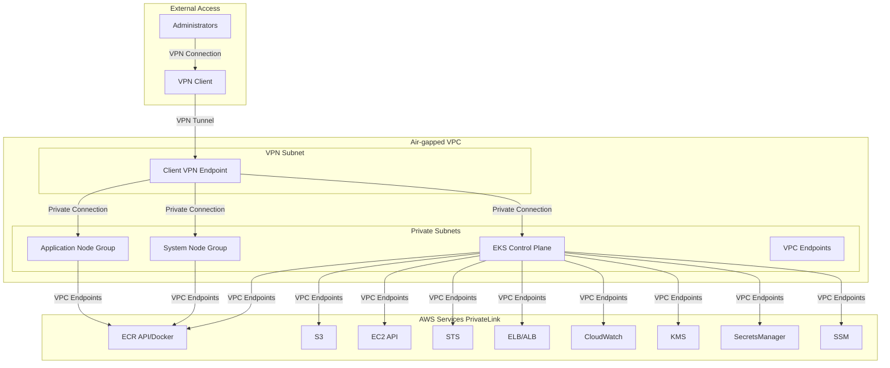
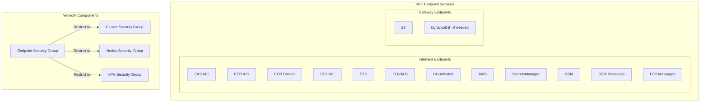
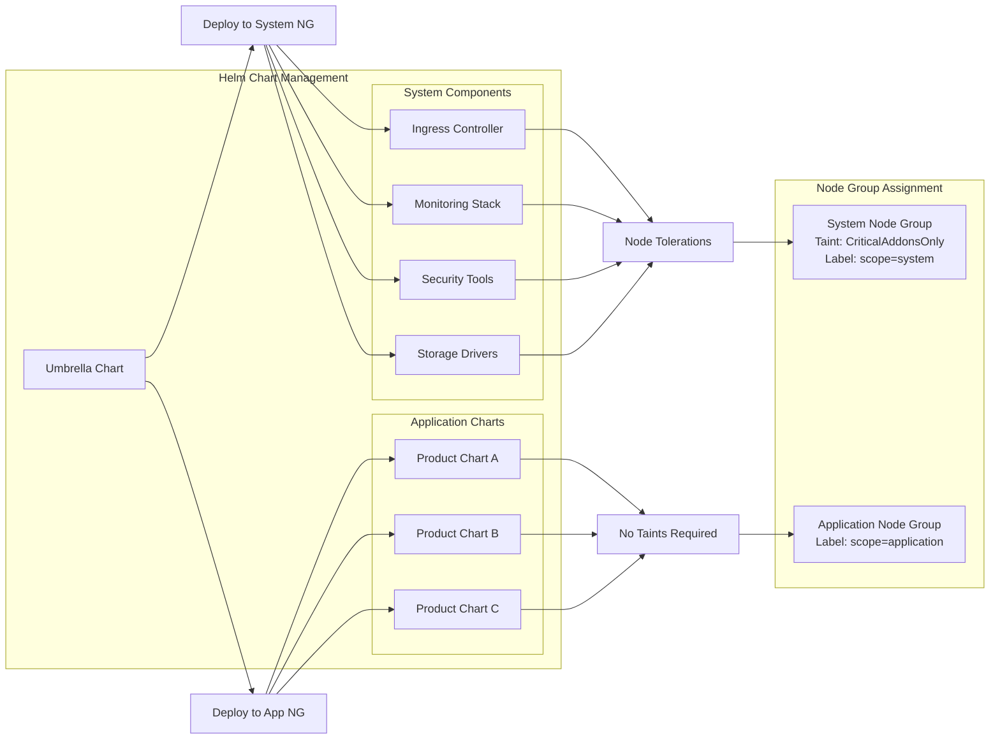

# ADR-001: Air-gapped EKS Environment Architecture

## Status
**Accepted**

## Overview
This decision record outlines the architecture for deploying a fully air-gapped EKS environment within the existing multi-cloud Terraform framework. The solution extends the current AWS modules to support private, isolated deployments for environments with strict security requirements such as healthcare, military, government systems, and regulated industries.

## Context
The current AWS module supports standard EKS deployments with optional private endpoints and basic VPC endpoints. However, for truly air-gapped deployments, additional components are required:

- Complete network isolation from the public internet
- Comprehensive VPC endpoint coverage for all AWS services
- External access mechanism for cluster management
- Pre-configured Helm chart deployment strategies
- Private ECR integration with air-gapped image management

## Decision
We will enhance the existing AWS modules with conditional logic to support `cluster_type = "airgap"` deployments while maintaining backward compatibility with current functionality.

## Architecture

### Core Components

#### 1. Enhanced VPC Module
- **Private Subnets Only**: No public subnets or internet gateway
- **Comprehensive VPC Endpoints**: Full coverage for EKS air-gap requirements
- **DNS Configuration**: VPC DNS resolver + conditional DNS forwarding
- **Security Groups**: Strict isolation with controlled access patterns

#### 2. Enhanced EKS Module
- **Private API Endpoint**: Public access completely disabled
- **Dedicated Node Groups**: System and application workload separation
- **Enhanced Security Groups**: VPC-restricted traffic patterns
- **Pre-configured Add-ons**: Umbrella chart deployment capabilities

#### 3. Client VPN Module (New)
- **VPN Endpoint**: OpenVPN-based access for cluster management
- **Certificate Management**: ACM integration for VPN certificates
- **Security Group Integration**: Controlled VPN-to-cluster access
- **DNS Resolution**: VPN-based DNS for cluster endpoint access

### Network Architecture



### VPC Endpoint Architecture



### Helm Deployment Strategy



## Detailed Components

### 1. VPC Requirements for Air-gap

#### Subnet Configuration
- **Private Subnets**: 3+ private subnets across availability zones
- **No Public Subnets**: Completely isolated from internet
- **VPN Subnet**: Dedicated subnet for Client VPN endpoint

#### VPC Endpoints Required

**Essential for EKS Air-gap:**
1. `com.amazonaws.<region>.eks` - EKS API access
2. `com.amazonaws.<region>.ecr.api` - ECR API access
3. `com.amazonaws.<region>.ecr.dkr` - Docker registry access
4. `com.amazonaws.<region>.ec2` - EC2 API instances
5. `com.amazonaws.<region>.sts` - IAM token service
6. `com.amazonaws.<region>.s3` - S3 storage (Gateway endpoint)
7. `com.amazonaws.<region>.elasticloadbalancing` - Load balancer control

**Optional but Recommended:**
8. `com.amazonaws.<region>.logs` - CloudWatch logging
9. `com.amazonaws.<region>.kms` - Key management
10. `com.amazonaws.<region>.secretsmanager` - Secrets access
11. `com.amazonaws.<region>.ssm` - Systems Manager
12. `com.amazonaws.<region>.ssmmessages` - SSM messaging
13. `com.amazonaws.<region>.autoscaling` - Auto scaling service

#### DNS Configuration
- **VPC DNS Resolver**: Primary DNS for VPC resources
- **Conditional Forwarding**: Forward only specific domains to VPC endpoints
- **Local DNS Cache**: For hostname resolution within VPC

### 2. Enhanced Security Model

#### Security Group Hierarchy

```hcl
# Example Security Group Structure
locals {
  airgap_security_groups = {
    cluster_sg = {
      ingress = from_bastion_and_vpn
      egress = to_vpc_endpoints_only
    }

    nodes_sg = {
      ingress = from_cluster_and_nodes
      egress = to_vpc_endpoints_only
    }

    vpc_endpoints_sg = {
      ingress = from_cluster_and_nodes
      egress = to_cluster_and_nodes
    }

    vpn_sg = {
      ingress = from_admin_networks
      egress = to_cluster_resources
    }
  }
}
```

#### Network Isolation Rules
- **No Internet Gateway**: Complete internet isolation
- **No NAT Gateway**: All traffic through VPC endpoints
- **VPC-Only Traffic**: Security groups restrict to VPC CIDR only
- **VPN Access Control**: Certificate-based authentication with IP restrictions

### 3. EKS Cluster Configuration

#### Control Plane Settings
```hcl
# Air-gap specific cluster configuration
variable "cluster_type" {
  description = "Type of EKS cluster deployment"
  type        = string
  default     = "api-product"

  validation {
    condition = contains(["api-product", "airgap"], var.cluster_type)
    error_message = "Cluster type must be either 'api-product' or 'airgap'."
  }
}

locals {
  cluster_config = var.cluster_type == "airgap" ? {
    endpoint_public_access  = false
    endpoint_private_access = true
    public_access_cidrs     = []

    # Enhanced security for air-gap
    security_group_rules = {
      restrict_to_vpc = true
      allow_vpn_only = true
    }
  } : {
    # Existing configuration for api-product
    endpoint_public_access  = false  # Current default
    endpoint_private_access = true   # Current default
    public_access_cidrs     = var.cluster_endpoint_public_access_cidrs
  }
}
```

#### Node Group Strategy

**System Node Group:**
- **Purpose**: Cluster-critical workloads (ingress, monitoring, security)
- **Taints**: `CriticalAddonsOnly=true:NoSchedule`, `CriticalAddonsOnly=true:NoExecute`
- **Labels**: `node.kubernetes.io/scope=system`
- **Size**: Based on system requirements (typically 2-3 nodes)

**Application Node Group:**
- **Purpose**: Application workloads and product deployments
- **Taints**: None (general purpose)
- **Labels**: `node.kubernetes.io/scope=application`
- **Size**: Based on application requirements (sizing map)

### 4. VPN Access Architecture

#### Client VPN Configuration
```hcl
# VPN endpoint configuration for air-gap access
resource "aws_ec2_client_vpn_endpoint" "airgap_vpn" {
  count = var.cluster_type == "airgap" ? 1 : 0

  client_cidr_block    = var.vpn_client_cidr_block  # e.g., "10.200.0.0/16"
  server_certificate_arn = aws_acm_certificate.server.arn
  authentication_options {
    type = "certificate-authentication"
    mutual_authentication {
      client_root_certificate_chain_arn = aws_acm_certificate.client.arn
    }
  }

  vpc_id = local.vpc_id
  security_group_ids = [aws_security_group.vpn_sg.id]

  dns_servers {
    ip_address = "172.16.0.2"  # VPC DNS resolver
  }

  # Target network associations
  subnet_ids = aws_subnet.private[*].id
}
```

#### Certificate Management
- **Server Certificate**: Generated using Easy-RSA and imported to ACM
- **Client Certificate**: Per-administrator certificates for secure access
- **Certificate Rotation**: Automated rotation policies implemented

### 5. Helm Integration Strategy

#### Umbrella Chart Structure
```yaml
# Chart.yaml for system-components umbrella
apiVersion: v2
name: system-components
description: Umbrella chart for EKS air-gap system components
type: application
version: 1.0.0
dependencies:
  - name: ingress-controller
    version: "4.x.x"
    repository: "file://./charts/ingress-controller"
  - name: monitoring-stack
    version: "2.x.x"
    repository: "file://./charts/monitoring-stack"
  - name: security-tools
    version: "3.x.x"
    repository: "file://./charts/security-tools"
```

#### Deployment Configuration
```hcl
# Helm deployment for air-gap environments
resource "helm_release" "system_components" {
  count = var.cluster_type == "airgap" ? 1 : 0

  name       = "system-components"
  namespace  = "kube-system"

  repository = "oci://private-ecr-repo-url/charts"
  chart      = "system-components"
  version    = var.system_chart_version

  values = [
    templatefile("${path.module}/helm/system-values.yaml.tpl", {
      node_selector = {
        "node.kubernetes.io/scope" = "system"
      },
      tolerations = [{
        key = "CriticalAddonsOnly",
        operator = "Equal",
        value = "true",
        effect = "NoSchedule"
      }]
    })
  ]

  depends_on = [aws_eks_node_group.system]
}
```

### 6. Private ECR Integration

#### Image Management Strategy
```hcl
# Private ECR repositories for air-gap environment
resource "aws_ecr_repository" "protected_repos" {
  for_each = var.cluster_type == "airgap" ? {
    system-charts = "system-components-charts"
    app-charts    = "application-charts"
    system-images = "system-container-images"
    app-images    = "application-container-images"
  } : {}

  name                 = each.key
  image_tag_mutability = "MUTABLE"

  image_scanning_configuration {
    scan_on_push = true
  }

  encryption_configuration {
    encryption_type = "KMS"
    kms_key         = aws_kms_key.ecr_key[0].arn
  }
}
```

#### Air-gap Image Sync Process
1. **External Sync**: Images synced from external registries to connected environment
2. **VPC Transfer**: Transfer to air-gap VPC via secure channel
3. **ECR Push**: Push to private ECR repositories
4. **Helm Deployment**: Deploy via umbrella charts referencing private ECR

## Implementation Strategy

### Phase 1: Core Infrastructure
1. Enhance VPC module with air-gap conditional logic
2. Add comprehensive VPC endpoint support
3. Implement enhanced security groups
4. Add Client VPN module

### Phase 2: EKS Enhancements
1. Extend EKS module with cluster_type conditional logic
2. Implement dual node-group strategy
3. Add helm integration capabilities
4. Enhanced security configurations

### Phase 3: Operational Features
1. Private ECR integration
2. Certificate management automation
3. Monitoring and logging for air-gap environments
4. Documentation and runbooks

### Phase 4: Testing and Validation
1. Integration testing for air-gap scenarios
2. Performance testing comparing standard vs air-gap
3. Security validation and compliance testing
4. User acceptance testing

## Migration and Compatibility

### Backward Compatibility
- `cluster_type` defaults to "api-product" maintaining current behavior
- All existing variables and configurations remain unchanged
- Optional air-gap features only activate when `cluster_type = "airgap"`

### Migration Path
1. **Existing Deployments**: No changes required, continue using api-product mode
2. **New Air-gap**: Set `cluster_type = "airgap"` for new deployments
3. **Hybrid Approach**: Deploy separate clusters for different requirements

## Security Considerations

### Enhanced Security Model
- **Zero Trust Architecture**: All traffic explicitly allowed via security groups
- **Certificate-based Access**: VPN access managed through X.509 certificates
- **VPC Endpoint Policies**: restrictive policies on endpoint access
- **Network Separation**: Complete isolation from internet and other VPCs

### Compliance Benefits
- **Data Sovereignty**: Data never leaves VPC boundaries
- **Access Control**: Audited VPN access with certificate management
- **Encryption**: End-to-end encryption for all communications
- **Audit Trail**: Complete logging via CloudWatch through VPC endpoints

## Cost Implications

### Additional Costs for Air-gap
- **VPC Endpoints**: ~$0.01 per hour per AZ per endpoint
- **VPN Endpoint**: ~$0.005 per connection hour + data transfer
- **Additional ENIs**: One ENI per VPC endpoint per AZ
- **Certificate Management**: Minimal ACM costs

### Cost Optimization Strategies
- **Selective Endpoints**: Only create endpoints for required services
- **Scheduled Endpoints**: Create/destroy non-critical endpoints schedule
- **Connection Limits**: Limit VPN concurrent connections
- **S3 Gateway**: Use gateway endpoints (free) vs interface endpoints

## Monitoring and Observability

### Enhanced Monitoring
- **VPC Endpoint Metrics**: Endpoint utilization and error rates
- **VPN Connection Monitoring**: Connection status and data transfer
- **Network Flow Logs**: Complete network visibility
- **CloudWatch Access**: Logs and metrics through VPC endpoints

### Alerting Strategy
- **Endpoint Health**: Alert on endpoint failures
- **VPN Access**: Alert on unauthorized connection attempts
- **Network Performance**: Alert on degraded connectivity
- **Resource Utilization**: Monitor node groups and storage

## Appendix A: Terraform Variable Definitions

### Core Variables
```hcl
variable "cluster_type" {
  description = "Type of cluster deployment: 'api-product' for current setup, 'airgap' for fully private"
  type        = string
  default     = "api-product"

  validation {
    condition     = contains(["api-product", "airgap"], var.cluster_type)
    error_message = "cluster_type must be either 'api-product' or 'airgap'."
  }
}

variable "vpn_client_cidr_block" {
  description = "CIDR block for VPN client connections (must not overlap VPC CIDR)"
  type        = string
  default     = "10.200.0.0/16"
}

variable "vpn_allowed_cidr_blocks" {
  description = "CIDR blocks allowed to connect to VPN endpoint"
  type        = list(string)
  default     = []
}

variable "airgap_vpc_endpoints" {
  description = "List of VPC endpoints to create for air-gap setup"
  type        = list(string)
  default = [
    "eks", "ecr.api", "ecr.dkr", "ec2", "sts", "s3",
    "elasticloadbalancing", "logs", "kms", "secretsmanager", "ssm"
  ]
}
```

### Helm Configuration Variables
```hcl
variable "system_helm_chart_version" {
  description = "Version of system components umbrella chart"
  type        = string
  default     = "1.0.0"
}

variable "system_chart_repository" {
  description = "Repository URL for system components chart"
  type        = string
  default     = ""
}

variable "enable_system_components" {
  description = "Enable deployment of system umbrella chart"
  type        = bool
  default     = false
}
```

## Appendix B: Sample Configuration

### Air-gap Configuration Example
```hcl
# terraform.tfvars for air-gap deployment
cluster_type = "airgap"

region = "us-east-1"
cluster_name = "airgap-production"

vpc_cidr = "172.16.0.0/16"
availability_zones_count = 3
node_size_config = "large"

# VPN Configuration
vpn_client_cidr_block = "10.200.0.0/16"
vpn_allowed_cidr_blocks = ["203.0.113.0/24"]

# Helm Configuration
enable_system_components = true
system_helm_chart_version = "1.2.0"
system_chart_repository = "123456789012.dkr.ecr.us-east-1.amazonaws.com/charts"

# Node Group Configuration
main_node_taints = [
  {
    key    = "CriticalAddonsOnly"
    value  = "true"
    effect = "NoSchedule"
  }
]

# Required KMS Key (must be pre-created)
kms_key_arn = "arn:aws:kms:us-east-1:123456789012:key/12345678-1234-1234-1234-123456789012"
```

## Conclusion

This architecture provides a comprehensive solution for deploying truly air-gapped EKS environments while maintaining compatibility with existing deployments. The modular approach allows for incremental adoption and provides significant security benefits for organizations with strict isolation requirements.

The enhanced AWS modules will support both standard and air-gapped deployments through the `cluster_type` variable, ensuring backward compatibility while adding powerful new capabilities for secure Kubernetes deployments.
