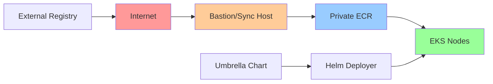
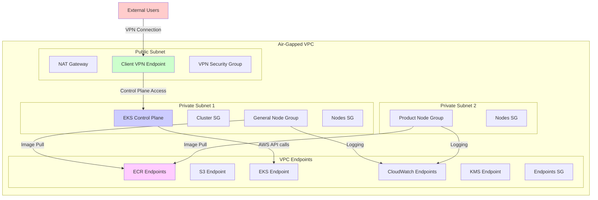
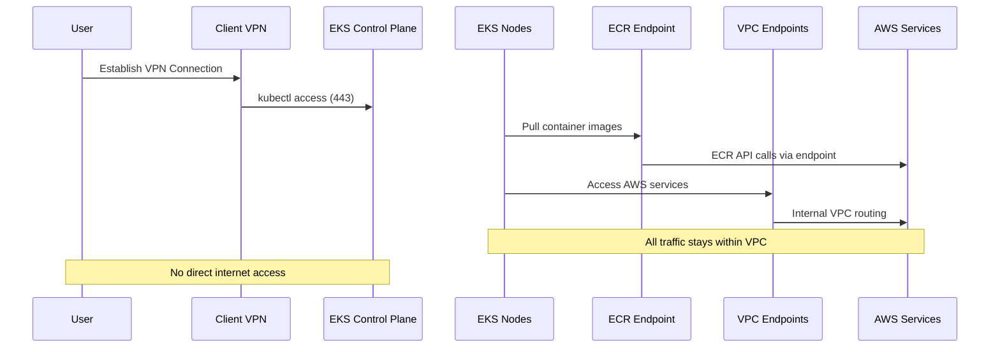
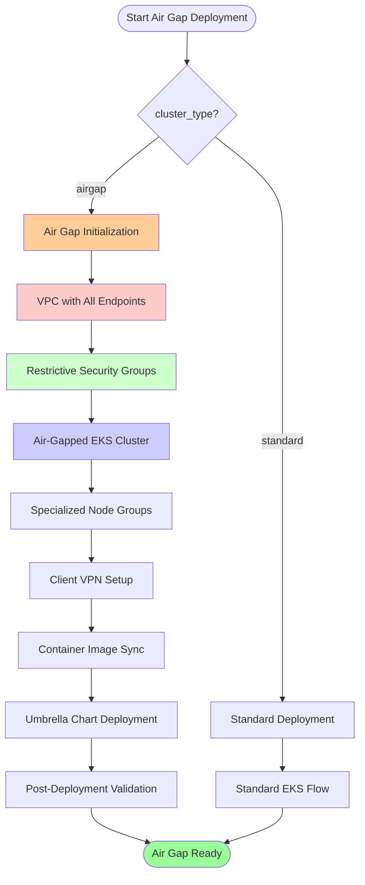

# ADR: Air-Gapped EKS Environment Implementation

## Status
Proposed

## Context
The organization requires the ability to deploy EKS clusters in fully air-gapped environments for security and compliance requirements. These clusters need to operate without direct internet access while maintaining the ability to pull container images, interact with AWS services, and provide external access through controlled means.

Current modules support basic VPC endpoints and private EKS clusters, but lack comprehensive air-gapped networking, dedicated node group configurations, and streamlined deployment workflows.

## Proposed Solution

### 1. Cluster Type Variable Architecture

Introduce a `cluster_type` variable that determines the deployment configuration:

```hcl
variable "cluster_type" {
  description = "Type of EKS cluster deployment"
  type        = string
  default     = "standard"
  validation {
    condition     = contains(["standard", "airgap"], var.cluster_type)
    error_message = "Cluster type must be either 'standard' or 'airgap'."
  }
}
```

**Behavior by cluster type:**
- **standard**: Current behavior - standard EKS with optional VPC endpoints
- **airgap**: Air-gapped configuration with comprehensive security controls

### 2. VPC Architecture Enhancements

#### Current VPC Endpoints (Standard):
- EKS, ECR (API/Docker), EC2, S3, CloudWatch Logs, STS, ELB, Auto Scaling, KMS, Secrets Manager, SSM

#### Additional Required VPC Endpoints (Air-Gapped):
- **monitoring**: CloudWatch Metrics
- **autoscaling-plans**: AWS Auto Scaling Plans
- **application-autoscaling**: Application Auto Scaling
- **cloudtrail**: AWS CloudTrail
- **monitoring**: CloudWatch Metrics
- **logs**: CloudWatch Logs (already exists)
- **tagging**: Resource Tagging API
- **events**: CloudWatch Events/EventBridge

#### Network Security Model:
```
Internet ←[BLOCKED]→ VPC ←[VPC ENDPOINTS]→ AWS Services
             ↑
             └── Client VPN ←[CONTROLLED ACCESS]→ External Users
```

### 3. EKS Node Group Strategy

#### Standard Cluster (Current):
- `main_app` node group
- `general_purpose` node group

#### Air-Gapped Cluster (Enhanced):
```hcl
# General workloads and system components
aws_eks_node_group "general-node-group" {
  # Standard instance types, system workloads
  # Untainted for general scheduling
}

# Product-specific workloads
aws_eks_node_group "product-node-group" {
  # Dedicated to product applications
  # May use different instance types
  # Can be tainted for workload isolation
}
```

#### Node Group Configuration Differences:
| Setting | Standard | Air-Gapped |
|---------|----------|------------|
| Security Group Egress | VPC CIDR + Internet | VPC CIDR ONLY |
| IAM Permissions | Standard EKS permissions | Enhanced for air-gap operations |
| Instance Profile | Standard | Additional S3 access for image sync |
| Autoscaling Target | CPU/Memory | Custom metrics for air-gap monitoring |

### 4. Private ECR Integration Strategy

#### Air-Gapped Image Management:


#### ECR Access Patterns:
1. **Image Synchronization Pipeline**:
   - Images copied from external registries to private ECR
   - Scheduled sync processes via Bastion host
   - Version tagging and retention policies

2. **Air-Gapped Operations**:
   - All ECR access through VPC endpoints
   - No direct internet connectivity
   - Local image caching strategies

### 5. Client VPN Integration

#### Access Layer Architecture:
```
External Users ←[Client VPN]→ VPC ←[Security Groups]→ EKS Control Plane
                                  ↓
                            Client VPN Endpoint
                                  ↓
                           Private Subnet
```

#### VPN Configuration:
- **Client VPN Endpoint**: AWS Client VPN service
- **Authentication**: SAML-based or certificate-based
- **Authorization**: Network-based ACLs and security groups
- **DNS**: Private Route53 for internal service resolution

### 6. Helm Deployment Strategy

#### Umbrella Chart Approach:
```yaml
# airgap-umbrella/Chart.yaml
apiVersion: v2
name: airgap-umbrella
description: Umbrella chart for air-gapped EKS deployments
type: application
version: 1.0.0
dependencies:
  - name: monitoring
    version: "1.0.0"
    condition: monitoring.enabled
  - name: logging
    version: "1.0.0"
    condition: logging.enabled
  - name: security
    version: "1.0.0"
    condition: security.enabled
  - name: networking
    version: "1.0.0"
    condition: networking.enabled
```

#### Deployment Process:
1. **Pre-installation**: Umbrella chart packaged with required images
2. **Image Transfer**: Images pushed to private ECR registry
3. **Helm Deployment**: Local chart repository deployment
4. **Validation**: Post-deployment health checks

### 7. Security Group Architecture

#### Air-Gapped Security Model:
```terraform
# EKS Cluster Security Group
resource "aws_security_group" "cluster_airgap" {
  # NO ingress from internet
  # VPN-only access for kubectl
  # All egress via VPC endpoints

  ingress {
    from_port       = 443
    to_port         = 443
    protocol        = "tcp"
    security_groups = [var.client_vpn_security_group_id]
    description     = "kubectl access via Client VPN"
  }
}

# Node Security Group
resource "aws_security_group" "nodes_airgap" {
  # Egress restricted to VPC CIDR only
  # No NAT gateway/internet access

  egress {
    from_port   = 0
    to_port     = 0
    protocol    = "-1"
    cidr_blocks = [var.vpc_cidr_block]
    description = "VPC internal traffic only"
  }
}
```

## Architecture Diagrams

### Network Architecture


### Data Flow Architecture


### Air-Gapped Deployment Flow


## Implementation Plan

### Phase 1: Core Infrastructure
1. **cluster_type Variable**: Add conditional logic to modules
2. **Enhanced VPC Endpoints**: Add missing AWS service endpoints
3. **Security Group Modifications**: Implement air-gap restrictions
4. **Testing**: Validate standard cluster functionality unchanged

### Phase 2: Air-Gapped Features
1. **Enhanced Node Groups**: Implement general/product node groups
2. **Client VPN Integration**: Add VPN endpoint configuration
3. **ECR Sync Documentation**: Create operational procedures
4. **Security Auditing**: Validate air-gap isolation

### Phase 3: Automation & Documentation
1. **Umbrella Chart**: Create Helm chart template
2. **Deployment Scripts**: Air-gap specific Terraform templates
3. **Operational Documentation**: Runbooks and procedures
4. **Validation Suite**: Air-gap compliance testing

## Migration Strategy

### Standard Cluster Migration:
```hcl
# Existing deployment - no changes required
cluster_type = "standard"  # default behavior

# New air-gap deployment
cluster_type = "airgap"    # enhanced security
```

### Backwards Compatibility:
- All existing `enable_vpc_endpoints` functionality preserved
- Standard cluster behavior unchanged
- New features controlled by `cluster_type` variable only

## Security Considerations

### Network Isolation:
- **Egress Filtering**: All internet traffic blocked at security group level
- **Endpoint Security**: Dedicated security groups for VPC endpoints
- **VPN Authentication**: Multi-factor authentication required
- **Audit Logging**: Comprehensive logging to CloudWatch via VPC endpoints

### Access Control:
- **IAM Policies**: Least privilege access for air-gap operations
- **Network Policies**: Kubernetes NetworkPolicies for pod isolation
- **Secret Management**: AWS Secrets Manager via VPC endpoint
- **Image Scanning**: ECR image scanning before air-gap deployment

### Operational Security:
- **Patch Management**: Controlled updates via internal repositories
- **Vulnerability Scanning**: Internal scanner deployment
- **Backup Strategy**: Cross-region replication within AWS private network
- **Disaster Recovery**: Air-gap aware recovery procedures

## Testing Strategy

### Validation Requirements:
1. **Network Isolation Tests**: Verify no internet access from nodes
2. **VPC Endpoint Tests**: Confirm all AWS services accessible via endpoints
3. **VPN Access Tests**: Validate external user access patterns
4. **Image Deployment Tests**: Umbrella chart deployment verification
5. **Failover Tests**: VPN endpoint recovery scenarios

### Compliance Verification:
- **SOC 2**: Security controls documentation
- **PCI DSS**: Payment card industry compliance (if applicable)
- **ISO 27001**: Information security management
- **NIST**: Security framework alignment

## Alternatives Considered

### Option 1: Separate Air-Gapped Module
- **Pros**: Complete separation of concerns
- **Cons**: Code duplication, maintenance overhead
- **Rejected**: Too much complexity for similar functionality

### Option 2: Air-Gapped Terraform Workspace
- **Pros**: State isolation, environment separation
- **Cons**: Operational complexity, workspace management
- **Rejected**: Over-engineering for this use case

### Option 3: Complete Module Rewrite
- **Pros**: Optimal air-gap design
- **Cons**: Breaking changes, migration risk
- **Rejected**: Prevents backwards compatibility

## Decision Rationale

The chosen approach using a `cluster_type` variable provides:
- **Backwards Compatibility**: Existing deployments unchanged
- **Feature Modularity**: Air-gap features enabled conditionally
- **Maintainability**: Single codebase for both deployment types
- **Operational Simplicity**: Clear configuration model

This approach balances the need for enhanced security with operational practicality and maintains the existing user experience while adding powerful air-gap capabilities.

## Conclusion

Implementing air-gapped EKS environments through the proposed cluster type variable approach provides a secure, maintainable, and backwards-compatible solution. The architecture leverages existing VPC endpoint capabilities while adding comprehensive security controls and specialized node group configurations.

The phased implementation approach allows for gradual adoption and thorough testing while maintaining operational stability for existing deployments.
