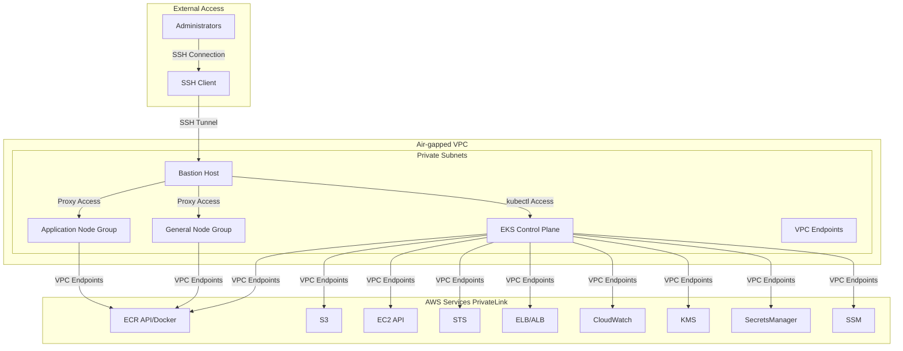
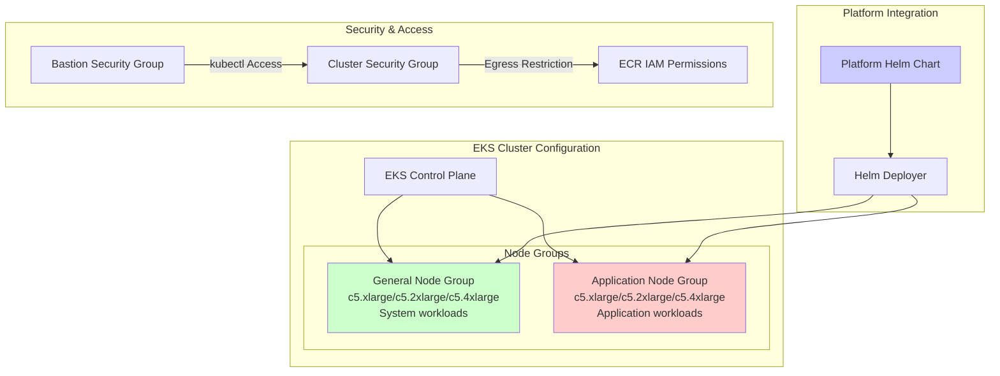
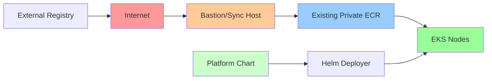

# ADR: Air-Gapped EKS Environment Architecture

## Status
**Accepted**

## Overview
This decision record outlines the architecture for deploying a fully air-gapped EKS environment within the existing multi-cloud Terraform framework. The solution extends the current AWS modules to support private, isolated deployments for environments with strict security requirements such as healthcare, military, government systems, and regulated industries.

## Context
The organization requires the ability to deploy EKS clusters in fully air-gapped environments for security and compliance requirements. These clusters need to operate without direct internet access while maintaining the ability to pull container images, interact with AWS services, and provide external access through controlled means.

Current modules support basic VPC endpoints and private EKS clusters, but lack comprehensive air-gapped networking, dedicated node group configurations, and streamlined deployment workflows.

## Decision
We will enhance the existing AWS modules with conditional logic to support `cluster_type = "airgap"` deployments while maintaining backward compatibility with current functionality. Instead of using a site-to-site VPN, we will leverage the existing bastion host module for cluster access.

## Architecture

### Core Components

#### 1. Enhanced VPC Module
- **Private Subnets Only**: No public subnets or internet gateway
- **Required VPC Endpoints**: Full coverage for EKS air-gap requirements (all endpoints are now required, not optional)
- **DNS Configuration**: VPC DNS resolver + conditional DNS forwarding
- **Security Groups**: Strict isolation with controlled access patterns

#### 2. Enhanced EKS Module
- **Private API Endpoint**: Public access completely disabled
- **Unified Node Groups**: General and application node groups using c5 instance types
- **Enhanced Security Groups**: VPC-restricted traffic patterns with bastion integration
- **Platform Chart Integration**: Conditional deployment of platform helm chart

#### 3. Bastion Host Integration
- **Existing Bastion Module**: Utilize current bastion host implementation
- **Security Group Updates**: Allow bastion to communicate with EKS cluster
- **kubectl Access**: Enable cluster management through bastion connection
- **No Site-to-Site VPN**: Eliminate dedicated VPN infrastructure

### Network Architecture



### Node Group Configuration

#### Instance Sizing Strategy
Both general and application node groups now use c5 instance family:
```hcl
# Updated sizing configuration
locals {
  instance_sizes = {
    small  = { general = "c5.xlarge", application = "c5.xlarge" }
    medium = { general = "c5.2xlarge", application = "c5.2xlarge" }
    large  = { general = "c5.4xlarge", application = "c5.4xlarge" }
  }
}
```

#### Node Group Architecture


### Platform Helm Chart Integration

#### Conditional Deployment Strategy
```hcl
# Platform chart deployment (conditional)
resource "helm_release" "platform_components" {
  count = var.enable_platform_components ? 1 : 0

  name       = "platform"
  namespace  = "platform-system"

  repository = var.platform_chart_repository
  chart      = "platform"
  version    = var.platform_chart_version

  values = [
    templatefile("${path.module}/helm/platform-values.yaml.tpl", {
      cluster_name = var.cluster_name
      region       = var.region
    })
  ]

  # Get kubeconfig from the created cluster
  depends_on = [
    aws_eks_node_group.general,
    aws_eks_node_group.application
  ]
}

# Kubeconfig provider for platform deployment
provider "helm" {
  kubernetes {
    host                   = data.aws_eks_cluster.cluster.endpoint
    cluster_ca_certificate = base64decode(data.aws_eks_cluster.cluster.certificate_authority[0].data)

    exec {
      api_version = "client.authentication.k8s.io/v1beta1"
      command     = "aws"
      args        = ["eks", "update-kubeconfig", "--name", var.cluster_name, "--region", var.region]
    }
  }
}

data "aws_eks_cluster" "cluster" {
  name = aws_eks_cluster.main.name
}
```

### Security Group Integration with Bastion

#### Enhanced Security Group Configuration
```hcl
# Cluster security group with bastion access
resource "aws_security_group_rule" "cluster_bastion_ingress" {
  count = var.cluster_type == "airgap" ? 1 : 0

  type                     = "ingress"
  from_port                = 443
  to_port                  = 443
  protocol                 = "tcp"
  source_security_group_id = module.bastion.security_group_id
  security_group_id        = aws_security_group.cluster.id
  description              = "kubectl access from bastion host"
}

# Node security groups for ECR access
resource "aws_security_group_rule" "nodes_ecr_egress" {
  count = var.cluster_type == "airgap" ? 1 : 0

  type              = "egress"
  from_port         = 443
  to_port           = 443
  protocol          = "tcp"
  cidr_blocks       = [var.vpc_cidr_block]
  security_group_id = aws_security_group.node.id
  description       = "ECR access via VPC endpoints"
}

# IAM role with ECR permissions
resource "aws_iam_role_policy_attachment" "node_ecr_policy" {
  count = var.cluster_type == "airgap" ? length(var.node_groups) : 0

  policy_arn = "arn:aws:iam::aws:policy/AmazonEC2ContainerRegistryReadOnly"
  role       = aws_iam_role.node_groups[count.index].name
}
```

## VPC Endpoint Requirements (Now Required)

The following VPC endpoints are **required** for air-gapped deployments (previously optional):

### Gateway Endpoints
- `com.amazonaws.<region>.s3` - S3 storage access

### Interface Endpoints
- `com.amazonaws.<region>.eks` - EKS API access
- `com.amazonaws.<region>.ecr.api` - ECR API access
- `com.amazonaws.<region>.ecr.dkr` - Docker registry access
- `com.amazonaws.<region>.ec2` - EC2 API instances
- `com.amazonaws.<region>.sts` - IAM token service
- `com.amazonaws.<region>.elasticloadbalancing` - Load balancer control
- `com.amazonaws.<region>.logs` - CloudWatch logging
- `com.amazonaws.<region>.monitoring` - CloudWatch metrics
- `com.amazonaws.<region>.kms` - Key management
- `com.amazonaws.<region>.secretsmanager` - Secrets access
- `com.amazonaws.<region>.ssm` - Systems Manager
- `com.amazonaws.<region>.ssmmessages` - SSM messaging
- `com.amazonaws.<region>.autoscaling` - Auto scaling service
- `com.amazonaws.<region>.application-autoscaling` - Application Auto Scaling

## ECR Integration Strategy

#### Existing Private ECR Integration


#### ECR Access Configuration
```hcl
# Use existing ECR repositories - no creation needed
data "aws_ecr_repository" "existing_repos" {
  for_each = var.cluster_type == "airgap" ? toset(var.existing_ecr_repositories) : toset([])
  name = each.value
}

# IAM policy for ECR access to existing repositories
resource "aws_iam_policy" "ecr_access_policy" {
  count = var.cluster_type == "airgap" ? 1 : 0
  name  = "${var.cluster_name}-ecr-access"

  policy = jsonencode({
    Version = "2012-10-17"
    Statement = [
      {
        Effect = "Allow"
        Action = [
          "ecr:GetAuthorizationToken",
          "ecr:BatchCheckLayerAvailability",
          "ecr:GetDownloadUrlForLayer",
          "ecr:GetRepositoryPolicy",
          "ecr:DescribeRepositories",
          "ecr:ListImages",
          "ecr:DescribeImages",
          "ecr:BatchGetImage"
        ]
        Resource = "*"
      },
      {
        Effect = "Allow"
        Action = [
          "ecr:GetAuthorizationToken"
        ]
        Resource = "*"
      },
      {
        Effect = "Allow"
        Action = [
          "ecr:BatchGetImage",
          "ecr:GetDownloadUrlForLayer"
        ]
        Resource = [for repo in var.existing_ecr_repositories : "arn:aws:ecr:${var.region}:${data.aws_caller_identity.current.account_id}:repository/${repo}"]
      }
    ]
  })
}
```

## Implementation Strategy

### Phase 1: Core Infrastructure Updates
1. Remove site-to-site VPN dependencies
2. Update bastion security groups for EKS access
3. Making VPC endpoints required for air-gap deployments
4. Update node group instance sizing to c5 family

### Phase 2: ECR and Platform Integration
1. Configure existing ECR repository access
2. Add IAM permissions for ECR access
3. Implement platform helm chart deployment
4. Create kubeconfig access pattern

### Phase 3: Testing and Validation
1. Test bastion-to-cluster connectivity
2. Validate VPC endpoint functionality
3. Test platform chart deployment
4. security validation for ECR access

## Migration and Compatibility

### Backward Compatibility
- `cluster_type` defaults to "standard" maintaining current behavior
- All existing variables and configurations remain unchanged
- New air-gap features only activate when `cluster_type = "airgap"`

### Migration Path
1. **Existing Deployments**: No changes required, continue using standard mode
2. **New Air-gap**: Set `cluster_type = "airgap"` and configure bastion credentials
3. **ECR Integration**: Provide existing ECR repository names in configuration

## Security Considerations

### Enhanced Security Model
- **Zero Trust Architecture**: All traffic explicitly allowed via security groups
- **Bastion-only Access**: Cluster access controlled through bastion host
- **Required VPC Endpoints**: Essential endpoints are mandatory (no optional configuration)
- **ECR Access Control**: Scoped IAM permissions for existing repositories

### Access Control
- **SSH Key Management**: Bastion access controlled through SSH keys
- **Security Group Rules**: Precise rules for bastion-to-cluster communication
- **IAM Role Permissions**: Least privilege for ECR and AWS service access

## Updated Variable Definitions

### Core Variables
```hcl
variable "cluster_type" {
  description = "Type of EKS cluster deployment: 'standard' for current setup, 'airgap' for fully private"
  type        = string
  default     = "standard"

  validation {
    condition     = contains(["standard", "airgap"], var.cluster_type)
    error_message = "cluster_type must be either 'standard' or 'airgap'."
  }
}

variable "enable_bastion_access" {
  description = "Enable bastion host for EKS cluster access in air-gap environments"
  type        = bool
  default     = true
}

variable "existing_ecr_repositories" {
  description = "List of existing private ECR repositories to use in air-gap environment"
  type        = list(string)
  default     = []
}

variable "enable_platform_components" {
  description = "Enable deployment of platform umbrella helm chart"
  type        = bool
  default     = false
}

variable "platform_chart_repository" {
  description = "Repository URL for platform helm chart"
  type        = string
  default     = ""
}

variable "platform_chart_version" {
  description = "Version of platform helm chart to deploy"
  type        = string
  default     = "latest"
}
```

### Updated Instance Sizing Variables
```hcl
variable "node_size_config" {
  description = "Instance size configuration for node groups"
  type        = string
  default     = "medium"

  validation {
    condition = contains(["small", "medium", "large"], var.node_size_config)
    error_message = "node_size_config must be one of: small, medium, large."
  }
}

locals {
  # Updated instance sizes using c5 family for both general and application
  instance_sizes = {
    small  = { general = "c5.xlarge", application = "c5.xlarge" }
    medium = { general = "c5.2xlarge", application = "c5.2xlarge" }
    large  = { general = "c5.4xlarge", application = "c5.4xlarge" }
  }
}
```

## Sample Configuration

### Air-gap Configuration Example
```hcl
# terraform.tfvars for air-gap deployment
cluster_type = "airgap"

region = "us-east-1"
cluster_name = "airgap-production"

vpc_cidr = "172.16.0.0/16"
availability_zones_count = 3
node_size_config = "large"

# Bastion Configuration
enable_bastion_access = true
bastion_instance_type = "t3.medium"

# ECR Configuration
existing_ecr_repositories = [
  "platform-charts",
  "platform-images",
  "application-images"
]

# Platform Helm Configuration
enable_platform_components = true
platform_chart_repository = "OCI://123456789012.dkr.ecr.us-east-1.amazonaws.com/platform-charts"
platform_chart_version = "1.2.0"

# Note: No VPN configuration required - using existing bastion
```

## Validation Checklist

### Network Security
- [ ] No internet access from EKS nodes
- [ ] All AWS service access through VPC endpoints
- [ ] Bastion can access EKS control plane
- [ ] EKS nodes can access existing private ECR

### Access Control
- [ ] EKS clusters only accessible via bastion
- [ ] Platform helm chart deploys when enabled
- [ ] IAM permissions scoped to existing ECR repositories
- [ ] Security groups properly restrict traffic

### Infrastructure Requirements
- [ ] All required VPC endpoints created
- [ ] Node groups use c5 instance family
- [ ] Platform components deployment works
- [ ] kubeconfig generation works for Helm provider

## Conclusion

This updated architecture provides a comprehensive air-gapped EKS solution that leverages existing infrastructure patterns. Key improvements include:

1. **Simplified Access Model**: Uses existing bastion host instead of dedicated VPN
2. **Required Endpoints**: All critical VPC endpoints are mandatory for air-gap operations
3. **Unified Instance Sizing**: c5 instance family across all node groups
4. **Existing ECR Integration**: Leverages current private ECR setup
5. **Platform Chart Integration**: Conditional deployment of monitoring/security components

The architecture maintains backward compatibility while providing enhanced security and operational efficiency for air-gapped deployments.
