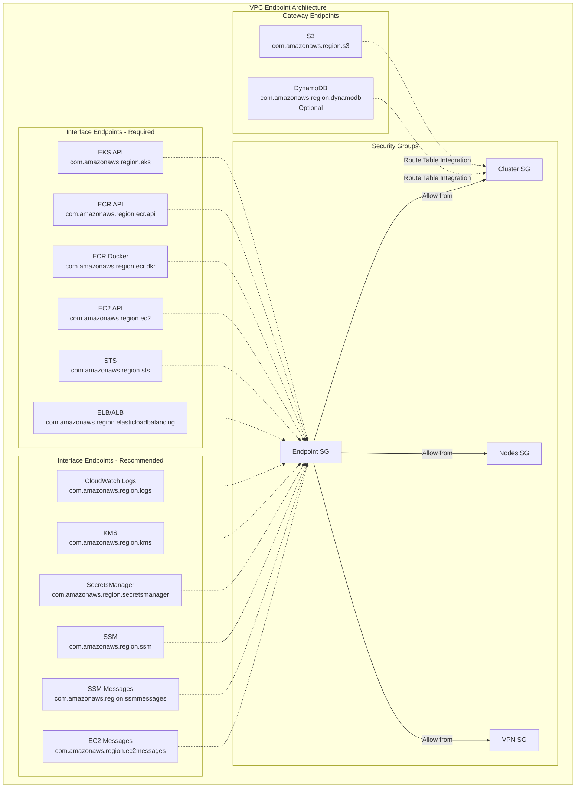
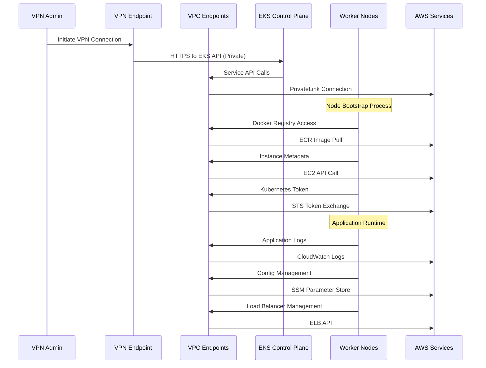
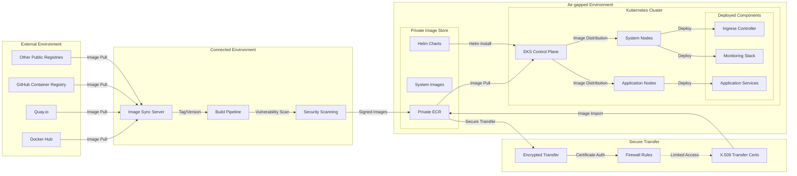
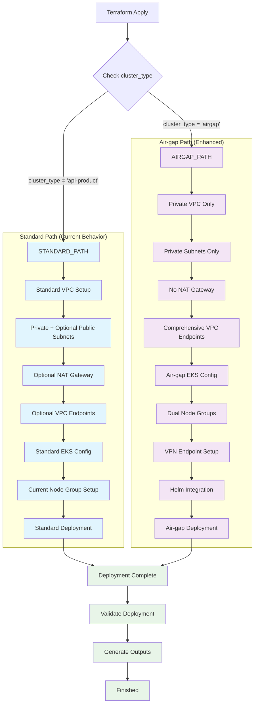
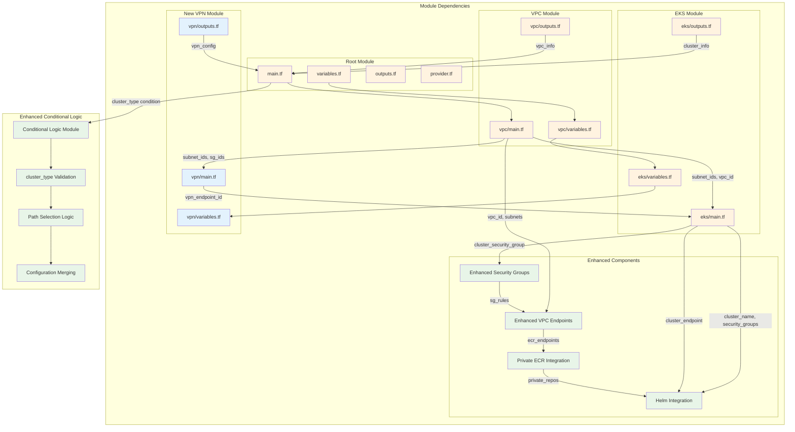

# Air-gapped EKS Architecture Diagrams

This document contains comprehensive Mermaid diagrams for the air-gapped EKS environment architecture.

## 1. High-level Architecture Overview

```mermaid
graph TB
    subgraph "External Access"
        ADMIN[Cloud Administrators]
        VPN_CLIENT[OpenVPN Client]
    end

    subgraph "AWS Environment"
        subgraph "Air-gapped VPC (172.16.0.0/16)"
            subgraph "VPN Subnet (172.16.100.0/24)"
                VPN[Client VPN Endpoint]
                VPN_SG[VPN Security Group]
            end

            subgraph "Private Subnets"
                subgraph "AZ1 - Private (172.16.1.0/24)"
                    EKS1[EKS Control Plane ENI]
                    NG1_System[System Node Group]
                    NG1_App[Application Node Group]
                    EP1[VPC Endpoints]
                end

                subgraph "AZ2 - Private (172.16.2.0/24)"
                    EKS2[EKS Control Plane ENI]
                    NG2_System[System Node Group]
                    NG2_App[Application Node Group]
                    EP2[VPC Endpoints]
                end

                subgraph "AZ3 - Private (172.16.3.0/24)"
                    EKS3[EKS Control Plane ENI]
                    NG3_System[System Node Group]
                    NG3_App[Application Node Group]
                    EP3[VPC Endpoints]
                end
            end

            subgraph "VPC Endpoint Network"
                subgraph "Interface Endpoints"
                    EKS_EP[EKS API]
                    ECR_EP[ECR API/DKR]
                    EC2_EP[EC2 Service]
                    STS_EP[STS Service]
                    ELB_EP[Load Balancer]
                    CW_EP[CloudWatch Logs]
                    KMS_EP[KMS]
                    SM_EP[Secrets Manager]
                    SSM_EP[SSM]
                end

                subgraph "Gateway Endpoints"
                    S3_EP[S3]
                end
            end
        end

        subgraph "AWS Services PrivateLink"
            ECR_SERVICE[Amazon ECR]
            S3_SERVICE[Amazon S3]
            AWS_EKS[Amazon EKS]
            AUTH_SERVICE[STS/IAM]
            LB_SERVICE[Load Balancers]
            MONITORING[CloudWatch]
            KEY_SERVICE[KMS]
            SECRET_SERVICE[Secrets Manager]
            CONFIG_SERVICE[Systems Manager]
        end
    end

    %% Connections
    ADMIN -->|Setup VPN Connection| VPN_CLIENT
    VPN_CLIENT -->|OpenVPN Tunnel| VPN
    VPN -.->|DNS Resolution| VPN_SG
    VPN -.->|Authorized Access| EKS1
    VPN -.->|Authorized Access| NG1_System
    VPN -.->|Authorized Access| NG1_App

    %% EKS to AWS Services via VPC Endpoints
    EKS1 -->|Private Connection| EKS_EP
    EKS_EP -->|PrivateLink| AWS_EKS

    NG1_System -->|Image Pull| ECR_EP
    ECR_EP -->|PrivateLink| ECR_SERVICE

    EKS1 -->|Blob Storage| S3_EP
    S3_EP -->|PrivateLink| S3_SERVICE

    EKS1 -->|Instance Management| EC2_EP
    EC2_EP -->|PrivateLink| AUTH_SERVICE

    EKS1 -->|Load Balancer Management| ELB_EP
    ELB_EP -->|PrivateLink| LB_SERVICE

    EKS1 -->|Log Forwarding| CW_EP
    CW_EP -->|PrivateLink| MONITORING

    EKS1 -->|Secret Access| SM_EP
    SM_EP -->|PrivateLink| SECRET_SERVICE

    %% VPN CloudWatch Access
    VPN -->|Log Transfer| CW_EP

    %% System Components to App Components
    NG1_System -->|API Calls| NG1_App
    NG1_System -->|Service Discovery| NG2_App
    NG1_System -->|Load Balancing| NG3_App
```



## 2. VPC Endpoint Architecture



## 3. Security Group Traffic Flow



## 4. Helm Chart Deployment Flow

```mermaid
flowchart TD
    subgraph "Helm Deployment Process"
        subgraph "Chart Sources"
            PRIVATE_ECR[Private ECR Repository]
            CHART_ARTIFACT[Helm Chart Archive(.tgz)]
            VALUES_TMPL[Values Template Files]
        end

        subgraph "Deployment Pipeline"
            INIT[Initialize Helm]
            ADD_REPO[Add Private ECR Repo]
            DEPLOY_UMBRELLA[Deploy Umbrella Chart]

            subgraph "System Component Deployment"
                INGRESS[Deploy Ingress Controller]
                MONITORING[Deploy Monitoring Stack]
                SECURITY[Deploy Security Tools]
                STORAGE[Deploy Storage Drivers]
            end

            subgraph "Application Deployment"
                APP_CHARTS[Deploy Application Charts]
                APP_CONFIG[Apply App Configurations]
                APP_ROLLOUT[Rollout Updates]
            end
        end

        subgraph "Node Group Assignment"
            SYSTEM_NG[System Node Group<br/>Scope: System<br/>Taint: CriticalAddonsOnly]
            APP_NG[Application Node Group<br/>Scope: Application<br/>No Taints]
        end

        subgraph "Post-Deployment"
            VALIDATE[Validate Deployment]
                HEALTH_CHECK[Health Check Deployment]
                CONNECTIVITY[Verify Connectivity]
        end
    end

    %% Flow Connections
    PRIVATE_ECR --> CHART_ARTIFACT
    VALUES_TMPL --> INIT

    INIT --> ADD_REPO
    ADD_REPO --> DEPLOY_UMBRELLA

    DEPLOY_UMBRELLA --> INGRESS
    DEPLOY_UMBRELLA --> MONITORING
    DEPLOY_UMBRELLA --> SECURITY
    DEPLOY_UMBRELLA --> STORAGE

    DEPLOY_UMBRELLA --> APP_CHARTS
    APP_CHARTS --> APP_CONFIG
    APP_CONFIG --> APP_ROLLOUT

    %% Node Group Assignments
    INGRESS -.->|tolerates CriticalAddonsOnly| SYSTEM_NG
    MONITORING -.->|tolerates CriticalAddonsOnly| SYSTEM_NG
    SECURITY -.->|tolerates CriticalAddonsOnly| SYSTEM_NG
    STORAGE -.->|tolerates CriticalAddonsOnly| SYSTEM_NG

    APP_CHARTS -.->|no taints required| APP_NG
    APP_CONFIG -.->|no taints required| APP_NG
    APP_ROLLOUT -.->|no taints required| APP_NG

    %% Validation
    APP_ROLLOUT --> VALIDATE
    VALIDATE --> HEALTH_CHECK
    VALIDATE --> CONNECTIVITY
```

## 5. Container Image Flow for Air-gap



## 6. Network Traffic Flow Analysis

```mermaid
flowchart TD
    subgraph "Traffic Categories"
        subgraph "Management Traffic"
            ADMIN_VPN[Admin VPN Connection]
            K8S_API[Kubernetes API]
            HELM_DEPLOY[Helm Deployments]
            KUBECTL[Kubectl Commands]
        end

        subgraph "Control Plane Traffic"
            ETCD_REPLICATION[etcd Replication]
            NODE_HEARTBEAT[Node Heartbeats]
            SCHEDULER_DEC[Scheduler Decisions]
            CONTROLLER_MGR[Controller Manager]
        end

        subgraph "Application Traffic"
            POD_COMM[Pod to Pod Comm]
            SVC_DISCOVER[Service Discovery]
            INGRESS_ROUTES[Ingress Routing]
            LOAD_BALANCER[Load Balancer]
        end

        subgraph "AWS Service Traffic"
            ECR_PULL[ECR Image Pull]
            S3_ACCESS[S3 Storage]
            CW_LOGS[CloudWatch Logs]
            IAM_STS[IAM/STS Tokens]
            ELB_ACCESS[Load Balancer API]
        end
    end

    subgraph "Network Pathways"
        subgraph "VPN Path"
            VPN_SERVER[VPN Server]
            VPN_ENI[VPN ENI]
        end

        subgraph "VPC Endpoint Path"
            INTERFACE_EP[Interface Endpoints]
            GATEWAY_EP[Gateway Endpoints]
        end

        subgraph "Internal VPC Path"
            CLUSTER_SG[Cluster SG Traffic]
            NODE_SG[Node SG Traffic]
            POD_NETWORK[Pod Network]
        end
    end

    %% Management Traffic Flow
    ADMIN_VPN -->|OpenVPN| VPN_SERVER
    VPN_SERVER -->|HTTPS| VPN_ENI
    VPN_ENI -->|Private IP| K8S_API
    K8S_API -->|gRPC| HELM_DEPLOY
    HELM_DEPLOY -->|gRPC| KUBECTL

    %% Control Plane Flow
    ETCD_REPLICATION -->|TCP| CLUSTER_SG
    NODE_HEARTBEAT -->|HTTPS| CLUSTER_SG
    SCHEDULER_DEC -->|gRPC| CLUSTER_SG
    CONTROLLER_MGR -->|gRPC| CLUSTER_SG

    %% Application Traffic Flow
    POD_COMM -->|Overlay Network| POD_NETWORK
    SVC_DISCOVER -->|DNS/ClusterIP| POD_NETWORK
    INGRESS_ROUTES -->|NodePort| POD_NETWORK
    LOAD_BALANCER -->|ELB API| INTERFACE_EP

    %% AWS Service Traffic Flow
    ECR_PULL -->|HTTPS| INTERFACE_EP
    S3_ACCESS -->|HTTPS| GATEWAY_EP
    CW_LOGS -->|HTTPS| INTERFACE_EP
    IAM_STS -->|HTTPS| INTERFACE_EP
    ELB_ACCESS -->|HTTPS| INTERFACE_EP
```



## 7. Conditional Logic Flow



## 8. Resource Dependency Graph


